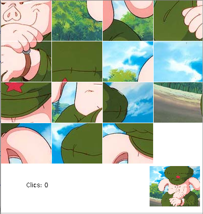
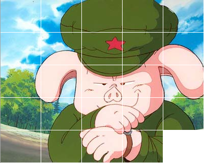

Trencaclosques
==========================
Trencaclosques de peces desplaçables fet en Java amb la llibreria ACM

L'objectiu és aconseguir formar la peça:

Compilació
---------------
El projecte ha estat convertit en Maven de manera que pot ser compilat i executat
simplement fent:

    $ mvn package
    $ cd target
    $ java -jar Puzzle-

TODO:
* Seria interessant permetre que es pugui triar la imatge.
* Es poden afegir efectes com desfer els talls al acabar la partida o fer que la peça sobre la que està el ratolí es mogui o s'escali.
* ...
